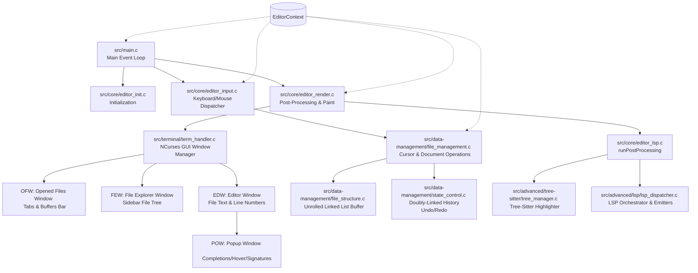

# Alwide System Architecture and Control Flow

Alwide is designed as a modular, lightweight text editor and IDE. Written in C, it binds to terminal services using `ncursesw` and implements rich IDE capabilities (such as AST-based syntax highlighting and code intelligence) using direct integrations with **Tree-Sitter** and a custom asynchronous **Language Server Protocol (LSP)** client.

---

## 1. System Architecture Diagram

The diagram below details the structural interactions between key modules, data structures, and terminal interfaces in Alwide.



---

## 2. Main Event Loop and Control Flow

The runtime control flow of Alwide operates inside a centralized, infinite `while (true)` loop defined in [src/main.c](file:///home/arno/dev/Alwide/src/main.c). The lifecycle is divided into three major stages: **Lifecycle Setup**, **The Active Event Loop**, and **Lifecycle Destruction**.

### Stage A: Program Setup
1. **System Environment Setup**: Calls `setupProgramEnvironnemnt()` inside [src/environnement/setup.c](file:///home/arno/dev/Alwide/src/environnement/setup.c). This configures signal handlers and creates temporary workspace directories (`/tmp/al/state_control/`).
2. **Configuration Loading**: Loads `cJSON` structures representing user settings and keybindings via `loadConfig()`.
3. **Language Feature Detection**: Scans and parses supported language profiles (extensions, shebangs, auto-pairs, LSP server command strings) via `ft_loadLanguageFeatures()`.
4. **Global Data Initialization**: Allocates and configures the active `ParserList` and active `LSPServerLinkedList` pools.
5. **Context Setup**: Allocates the `EditorContext` state record and initiates terminal interfaces using `gui_initNCurses()`.
6. **Workspace Scan**: Detects project-level settings and automatically populates the `FileExplorer` tree.
7. **Buffer Population**: Allocates a `FileContainer` for each opened file passed through cli arguments and loads their contents into memory.

### Stage B: The Active Event Loop
During the active state, the editor continuously executes the following sequential operations:

```
[Loop Start]
     │
     ▼
┌────────────────────────────────────────────────────────┐
│ 1. Run Post-Processing                                 │
│    - Re-parses AST query trees if the buffer modified   │
│    - Syncs document changes to background LSP servers   │
└────────────────────────────────────────────────────────┘
     │
     ▼
┌────────────────────────────────────────────────────────┐
│ 2. Run GUI Update                                      │
│    - Computes Line Number widths based on row count    │
│    - Repaints OFW (tabs), FEW (explorer), EDW (text)   │
└────────────────────────────────────────────────────────┘
     │
     ▼
┌────────────────────────────────────────────────────────┐
│ 3. Block & Read Next Input Event                       │
│    - Reads keystroke or mouse click from NCurses       │
│    - Resolves raw characters into unified hashes       │
└────────────────────────────────────────────────────────┘
     │
     ▼
┌────────────────────────────────────────────────────────┐
│ 4. Read & Handle LSP Pipes                             │
│    - Polls server sockets non-blockingly via IPC pipes │
│    - Dispatches JSON-RPC packets into compiler data    │
└────────────────────────────────────────────────────────┘
     │
     ▼
┌────────────────────────────────────────────────────────┐
│ 5. Discharging Input Events                            │
│    - If Popup Window is visible, offer input first     │
│    - If Popup ignores, delegate to runKeyHandler       │
└────────────────────────────────────────────────────────┘
     │
     ├─► [Action: EVENT_QUIT] ───────► [Break Loop]
     ├─► [Action: EVENT_READ_INPUT] ──► [Go to Step 3]
     └─► [Action: EVENT_CONTINUE] ────► [Go to Step 1]
```

1. **`runPostProcessing`**: Executes incremental actions required prior to painting, such as updating syntax highlighting indexes or syncing modifications to active LSPs.
2. **`runGuiUpdate`**: Refreshes window layout geometry (handling terminal resizes) and commands `wrefresh()` on modified panels.
3. **`readNextInput`**: Blocks on NCurses `getch()`. Resolves keyboard constants and UTF-8 escape sequences into hashed event tokens (e.g., mapping combinations like `Ctrl+Left` to a single integer).
4. **`handleLspServers`**: Inspects standard out/error pipes from active language servers. Gathers compiler diagnostics, completions, and signatures asynchronously.
5. **Event Routing**:
   - **Popup Capture**: If an interactive popup (like completion dropdowns) is active, input goes to `handlePopupInput()`. If captured (e.g., arrow keys navigating completions or `Enter` choosing an item), the loop skips regular key handling.
   - **Standard Key Handler**: If popup ignores the input, `runKeyHandler()` maps the hashed key token to actions such as cursor traversal, text insertion, selection management, clipboard options, or undo/redo requests.

### Stage C: Cleanup and Destruction
When `runKeyHandler()` returns `EVENT_QUIT`, the main loop breaks, and `finalizeEditor()` is invoked:
1. **Save Session States**: Serializes undo history trees to local caches under `/tmp/al/` for state persistence.
2. **Terminate LSP Servers**: Sends shutdown messages to each spawned LSP subprocess and cleans up IPC pipe descriptors.
3. **Destroy GUI**: Shuts down NCurses, resets system terminal settings, and restores visual standard outputs.
4. **Free Memory Resources**: Iterates through structures, freeing heap allocations for the file explorer tree, parser tables, file buffer lists, and active document nodes.

---

## 3. Core Directory and Module Breakdown

Alwide’s codebase is strictly structured into specialized layers:

* **`src/core/`**: Orchestrates application life cycles. Drives context allocations (`editor_context`), key handlers (`editor_input`), rendering phases (`editor_render`), and LSP sync managers (`editor_lsp`).
* **`src/data-management/`**: Core document representation. Implements the unrolled double-linked list model (`file_structure`), editing operations (`file_management`), and undo/redo structures (`state_control`).
* **`src/terminal/`**: Visual layout rendering. Manages ncurses windows (`windows/few.c`, `windows/edw.c`, etc.), click/drag mouse logic (`click_handler`), and color-theme highlighting (`highlight`).
* **`src/advanced/`**: Intelligent IDE capabilities:
  - **`lsp/`**: Multiplexes JSON-RPC pipelines (`lsp_client`) and handles specific LSP requests like definitions, signature helps, hovers, formatting, and autocompletion.
  - **`tree-sitter/`**: Integrates tree-sitter ASTs (`tree_manager`), compiles highlight queries (`tree_query`), and performs semantic coloring.
  - **`intelligence/`**: Implements IDE quality-of-life behaviors like auto-closing bracket pairs and comment toggling.
* **`src/config/`**: Parses global JSON settings and handles file-extension based language detections (`language_feature`).
* **`src/environnement/`**: Prepares operating paths, temporary caching directories, and declares editor-wide layout constants.
* **`src/utils/`**: General helper routines including string manipulations, system-level clipboard integrations, and key name converters.

---

## 🗺️ Codebase Documentation Map

* **[Back to Master README](file:///home/arno/dev/Alwide/README.md)**
* **[System Architecture](file:///home/arno/dev/Alwide/doc/architecture.md)** | **[Buffer Data Structures](file:///home/arno/dev/Alwide/doc/data_structures.md)** | **[Tree-Sitter Highlighting](file:///home/arno/dev/Alwide/doc/tree_sitter.md)** | **[Asynchronous LSP Client](file:///home/arno/dev/Alwide/doc/lsp_client.md)** | **[UI Windows & Features](file:///home/arno/dev/Alwide/doc/features.md)**

